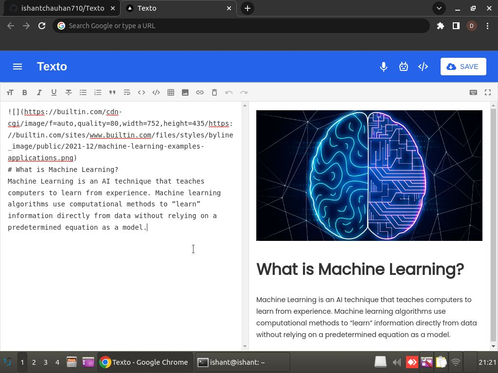
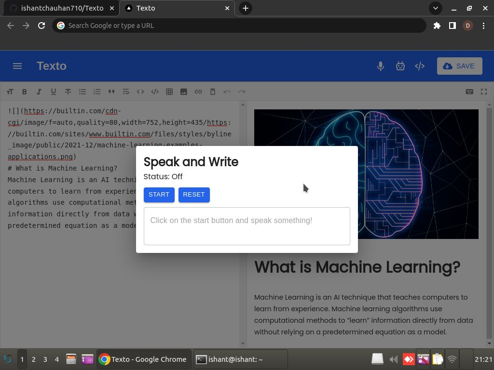
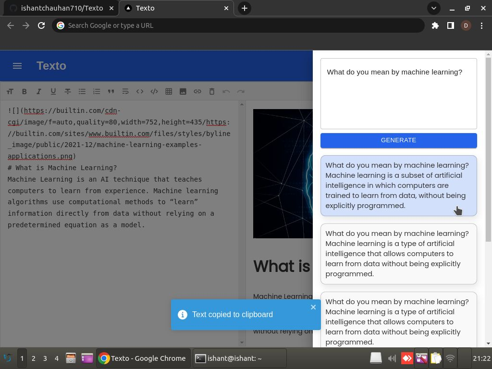

# Texto
Texto is a light weighted AI based content writing web app. With an input of just 5 words, a user can easily generate 5 different paragraphs!

# Features
- AI based content generation
- Voice to speech typing
- Rich text editor
- Auto caching (In case your laptop runs out of battery, your data will still be available when you restart your PC)
- Support for PDF export 
- Support for raw markdown export
- Toggle screen between editor and preview mode

# Built Using
- NextJS
- MaterialUI

# Screenshots

# Contact
For any queries, you can mail me at developerishant710@gmail.com
